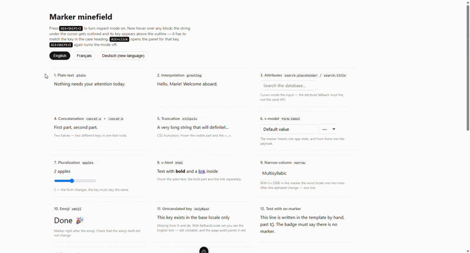
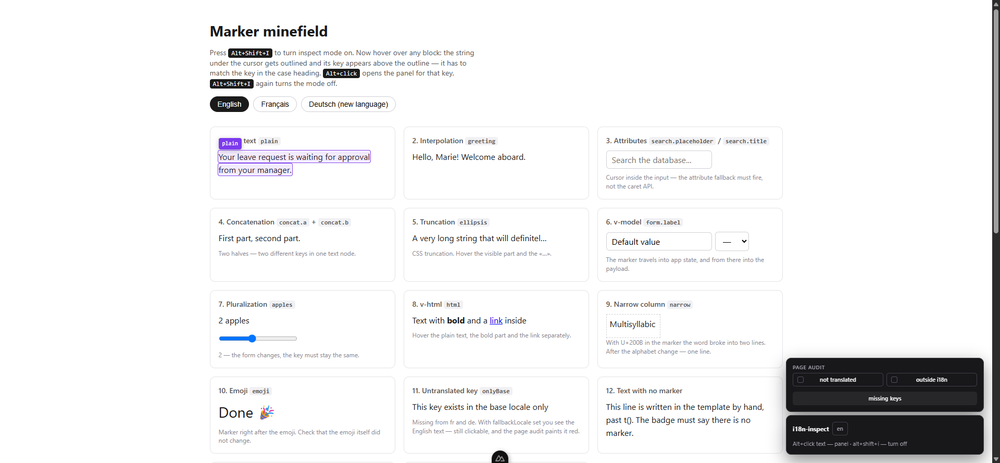
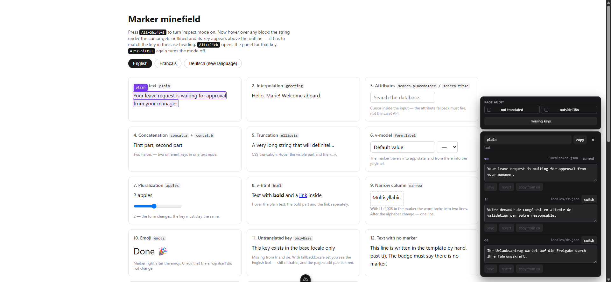
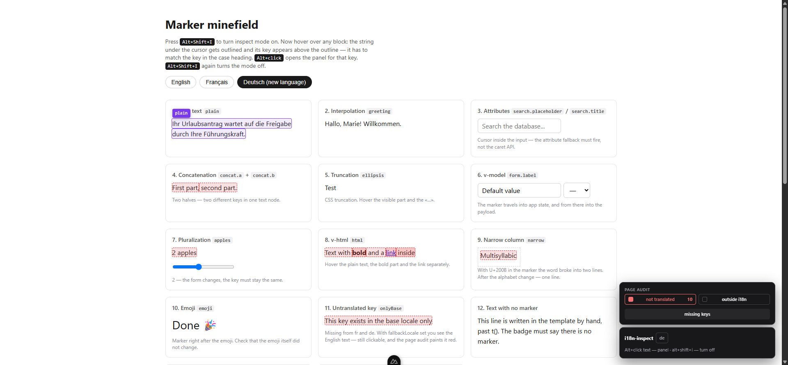
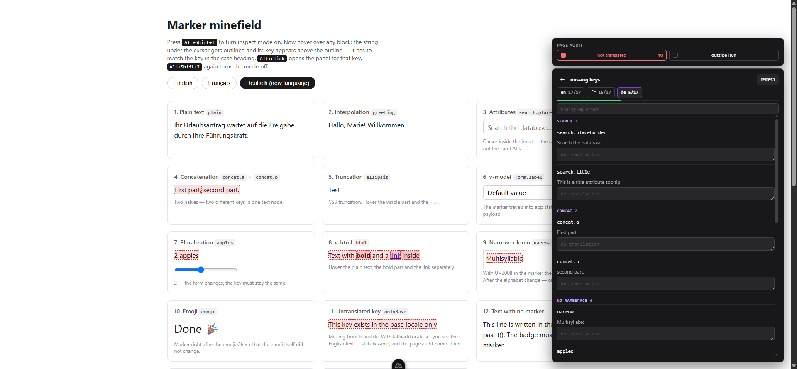

# nuxt-i18n-inspect

[](https://www.npmjs.com/package/nuxt-i18n-inspect)

Alt-click any text in your running Nuxt app, edit it, and the change lands in your locale JSON file. No backend, no database, no sync service — the files in your git repository are the only source of truth.



[**Try it in the browser.**](https://stackblitz.com/github/Polkilof/nuxt-i18n-inspect?file=demo%2Fi18n%2Flocales%2Fen.json) StackBlitz boots a real dev server, so an edit really does rewrite `en.json` in the file tree next to you. The [overview page](https://polkilof.github.io/nuxt-i18n-inspect/) is a static build — it shows what the module looks like, but nothing on it can be edited.

```bash
npm i -D nuxt-i18n-inspect
```

```ts
export default defineNuxtConfig({
  modules: ['@nuxtjs/i18n', 'nuxt-i18n-inspect'],
})
```

That is the whole setup. No `i18n.config.ts` changes — the module installs its hook at runtime.

## Why

Translation platforms want to own your strings. You push keys to their server, translators work there, you pull the result back, and now two systems disagree about what the truth is.

This module does not have a server. It appends an invisible marker to every translated string in dev, reads the key back out of the DOM under your cursor, and writes your edit straight into the JSON file. Your diff, your branch, your review, your deploy.

## Controls

| key | action |
|---|---|
| `Alt+Shift+I` | toggle inspect mode |
| hover | outline the string under the cursor and show its key |
| `Alt+click` | open the panel: this key in **every** locale |
| `Ctrl+Enter` | write the edit to the locale file |
| `Esc` | close the panel; again — leave inspect mode |





Change the combination with `i18nInspect: { hotkey: 'ctrl+k' }`.

Writes go through a temp file and a rename, preserve the source file's indentation and key order, and `@nuxtjs/i18n` HMR picks the change up without a page reload.

## Two ways to find work

**Page audit** answers "what is wrong on this screen":

| toggle | highlights |
|---|---|
| **not translated** (red) | the key is missing from the current locale — you are looking at the fallback |
| **outside i18n** (amber) | no marker at all — the string is hardcoded past `t()` |



The second one is noisy by nature: it finds headings, captions and anything nobody ever meant to translate. Numbers, punctuation and single characters are filtered out; exclude the rest with `data-i18n-ignore` on a container.

**Key list** answers "what is left in the whole project". It reads the locale files instead of walking the page, because walking the page can never be complete — a string has to render to be marked, and error states, empty states and modals will not render on their own.

For every locale it shows coverage (`de 412/500`), groups the missing keys by namespace so you translate one context at a time, and puts the base-language text under each key so whoever is writing has something to work from.



Two more things it reports, both deliberately kept out of the main count:

- **looks like a copy of the base** — the value is identical to the source language. Often perfectly legitimate (`OK`, `Email`, `PDF`, brand names), so it is a separate collapsed section rather than noise in the list.
- **dead keys** — present in this locale, gone from the base one. Leftovers from deleted features. Shown, never deleted for you.

Each row saves on its own, on blur or `Enter`. There is no "save all" button on purpose: a batch would mean holding a session of edits in a tab that reloads on every code change in dev, and losing all of it at once.

## Adding a language that does not exist yet

If a key is missing from the current locale and `fallbackLocale` is configured, the page shows the base language — and that text is still clickable, because the marker carries the correct key.

Two settings worth putting in **your** `i18n.config.ts`:

```ts
export default defineI18nConfig(() => ({
  fallbackLocale: 'en',
  // without these, vue-i18n logs two warnings per missing key per render
  missingWarn: false,
  fallbackWarn: false,
}))
```

`fallbackLocale` only works from there. It is not an option of the `@nuxtjs/i18n` module, and in `nuxt.config` it is silently ignored.

## Dev only

In a production build the module registers nothing: no plugin, no route, no marker, no bytes. The hook that appends markers and the three routes that read and write files exist only while `nuxt dev` is running.

Set `i18nInspect: { enabled: true }` to force it on — needed for preview deployments, and for nothing else.

## Limitations

Markers survive more than you would expect, and the playground in this repository is a minefield page built specifically to break them. What holds:

| case | works | why |
|---|---|---|
| plain text in `<p>` | yes | |
| interpolation `t('greeting', { name })` | yes | the marker rides along on the result |
| `placeholder`, `title` and other attributes | yes | resolved from the element, not the text node |
| concatenation `t('a') + ' ' + t('b')` | yes | the outline covers exactly the half you point at |
| `text-overflow: ellipsis` | yes | the marker is not part of the visible width |
| pluralization | yes | the key stays the same across forms |
| `v-html` | yes | resolved from every text node inside |
| emoji | yes | the alphabet avoids ZWJ, so sequences stay intact |
| `<textarea>` and `<input>` values | yes | the caret API does not reach inside a form control, so the `@value` fallback resolves it |
| `contenteditable` | until the text is replaced | typing next to the marker keeps it; select-all-and-retype wipes it |

What breaks, and there is no way around it:

**A marked string is no longer usable as data.** `t('x') === 'Yes'` is false. `.length` lies. `.slice()` cuts the key off and the string becomes uneditable. `v-model` carries invisible characters into your payload. Use `stripMarkers()` at those places:

```ts
import { stripMarkers } from 'nuxt-i18n-inspect/runtime/marker'
```

This only matters in dev — in production nothing is appended in the first place — but a dev-only comparison bug is still a bug you will spend an evening on.

**HTML in locale messages needs one more setting.** If any message contains tags, `unplugin-vue-i18n` refuses to build the client locale chunk. The symptom is misleading: SSR looks fine, the client shows raw keys, and the console complains about hydration. The fix:

```ts
i18n: { compilation: { strictMessage: false } }
```

**Only JSON locales.** `@nuxtjs/i18n` also accepts `.js` and `.ts` locale files; those can hold arbitrary expressions, and this module will not try to rewrite them.

## Development

```bash
npm install
npm run dev      # the minefield playground
npm test         # unit tests + an SSR test asserting markers in server HTML
```

`playground/` is not a demo, it is a test bench: fourteen of the nastiest cases on one page. After any change, every one of them should still resolve to the right key.

## License

MIT
